STA 380, Part 2: Exercises 1
============================

Exploratory Analysis on Vote Undercount in Georgia
---------------------------------------------------
The following investigates the issue of vote undercount in Georgia for the 2000 presidential election using data from 159 counties. Undercount is defined as the difference between the number of ballots cast and the number of legal votes recorded.

The analysis below will illuminate two issues: (1) whether voting certain kinds of voting equipment lead to higher rates of undercount, and (2) if so, whether we should worry that this effect has a disparate impact on poor and minority communities.

```r
# Import data
setwd("C:/Users/Julia Wu/Desktop/Predictive Models 2/STA380/data")
georgia = read.csv("georgia2000.csv")
```


```r
# Calculate the percent of votes that were undercounted
georgia$percent_undercount <- (georgia$ballots - georgia$votes)/georgia$ballots
```
The boxplot shows median undercount percentages to be fairly consistent across voting equipment, with the median for punch card being slightly higher. There are 5 outliers above the maximum - 1 for lever and 4 for optical. The outliers for optical are interesting as they indicate particularly high undercount percentages in 4 counties. These outliers are likely the result of factors outside of the voting equipment used.

```r
# Make a boxplot of voting equipment and undercount
boxplot(percent_undercount~equip, data=georgia, main="Undercount by Equip", xlab="Voting Equipment", ylab="Percent Undercount")
```

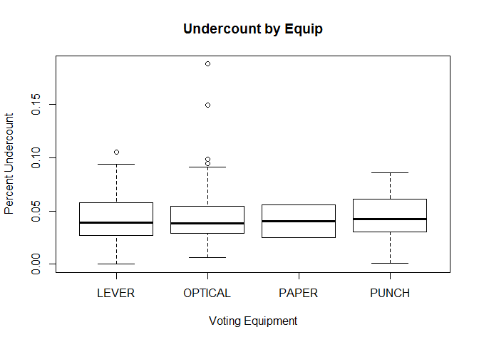 


```r
# Check variables in georgia
head(georgia, 2)
```

```
##     county ballots votes equip poor urban atlanta perAA gore bush
## 1  APPLING    6617  6099 LEVER    1     0       0 0.182 2093 3940
## 2 ATKINSON    2149  2071 LEVER    1     0       0 0.230  821 1228
##   percent_undercount
## 1         0.07828321
## 2         0.03629595
```

```r
# Remove county, ballots, and votes
georgia = georgia[,c(-1,-2,-3)]
```
Running a multiple linear regression reveals a strong and positive relationship between equipOPTICAL and percent_undercount with a regression coefficient of 1.381e-02 and a t-value of 3.412. EquipPUNCH is also a strong predictor of percent_undercount with a regression coefficient of 1.424e-02 and a t-value of 2.128. The results indicate that voting with punch cards and optical scans results in higher undercount percentages.

The regression output is consistent with our observations from the box plot as punch cards tend to have higher undercount percentages than the other voting equipment do. Likewise, the relationship between equipOPTICAL and percent_undercount was probably in large due to the outliers we saw.

```r
# Run a multiple linear regression predicting undercount
lm.georgia = lm(percent_undercount~., data=georgia)
summary(lm.georgia)
```

```
## 
## Call:
## lm(formula = percent_undercount ~ ., data = georgia)
## 
## Residuals:
##       Min        1Q    Median        3Q       Max 
## -0.064135 -0.011683 -0.001676  0.010158  0.123612 
## 
## Coefficients:
##                Estimate Std. Error t value Pr(>|t|)    
## (Intercept)   3.119e-02  4.483e-03   6.957 1.02e-10 ***
## equipOPTICAL  1.381e-02  4.049e-03   3.412 0.000831 ***
## equipPAPER   -1.070e-02  1.592e-02  -0.672 0.502531    
## equipPUNCH    1.424e-02  6.694e-03   2.128 0.035012 *  
## poor          1.938e-02  4.785e-03   4.050 8.21e-05 ***
## urban        -7.116e-03  5.078e-03  -1.401 0.163206    
## atlanta      -6.872e-03  8.402e-03  -0.818 0.414724    
## perAA         1.079e-03  1.407e-02   0.077 0.938990    
## gore          2.701e-07  1.732e-07   1.559 0.121092    
## bush         -3.275e-07  1.983e-07  -1.652 0.100671    
## ---
## Signif. codes:  0 '***' 0.001 '**' 0.01 '*' 0.05 '.' 0.1 ' ' 1
## 
## Residual standard error: 0.02206 on 149 degrees of freedom
## Multiple R-squared:  0.2635,	Adjusted R-squared:  0.219 
## F-statistic: 5.922 on 9 and 149 DF,  p-value: 4.657e-07
```
Plotting poor and equip reveals that poor counties use optical scans and punch cards less frequently than non-poor counties do. Therefore the impact of higher undercount percentages will be on non-poor counties.

```r
# Plot equip against poor, perAA, and urban
plot(georgia$equip~georgia$poor, xlab = "Poor", ylab = "Equip")
```

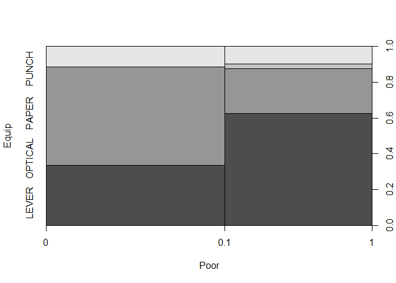 

Plotting equip and perAA shows that counties with high African American populations use optical scans less frequently and punch cards more frequently than counties with low African American populations do. Therefore undercount percentages in counties with high African American populations will be affected by their punch card usage.

```r
plot(georgia$equip~georgia$perAA, xlab = "PerAA", ylab = "Equip")
```

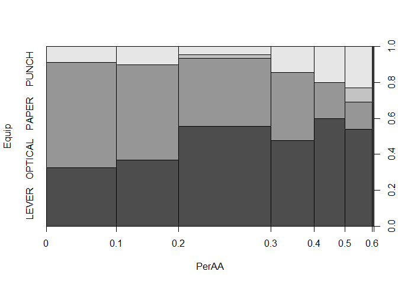 


Evaluating ETF Portfolios with Bootstrapping
--------------------------------------------
In the following, bootstrap resampling will be used to estimate the 4-week (20-trading day) value at risk of 3 portfolios at the 5% level. An evenly split portfolio, a safe/risk averse portfolio, and an aggressive/risk seeking portfolio will be assessed. These portfolios will be composed of 5 ETFs - SPY, TLT, LQD, EEM, and VNQ. 

```r
# Import libraries
library(mosaic)
library(fImport)
library(foreach)
```


```r
# Import five years of daily data on ETFs SPY, TLT, LQD, EEM, and VNQ
funds = c("SPY", "TLT", "LQD", "EEM", "VNQ")
prices = yahooSeries(funds, from='2009-01-01', to='2014-12-31')

# Add helper function for calculating percent returns from Yahoo Series
YahooPricesToReturns = function(series) {
	mycols = grep('Adj.Close', colnames(series))
	closingprice = series[,mycols]
	N = nrow(closingprice)
	percentreturn = as.data.frame(closingprice[2:N,]) / as.data.frame(closingprice[1:(N-1),]) - 1
	mynames = strsplit(colnames(percentreturn), '.', fixed=TRUE)
	mynames = lapply(mynames, function(x) return(paste0(x[1], ".PctReturn")))
	colnames(percentreturn) = mynames
	as.matrix(na.omit(percentreturn))
}

# Compute the returns from the closing prices
returns = YahooPricesToReturns(prices)
head(returns,2)
```

```
##            SPY.PctReturn TLT.PctReturn LQD.PctReturn EEM.PctReturn
## 2009-01-05  -0.001183312   -0.02578427   0.006858200    0.01299691
## 2009-01-06   0.006677471   -0.01005734   0.001678158    0.02264153
##            VNQ.PctReturn
## 2009-01-05   -0.01841886
## 2009-01-06    0.04994226
```

```r
# Plot returns for each ETF and assess risk and return
plot(returns[,1], type='l', main='SPY')
```

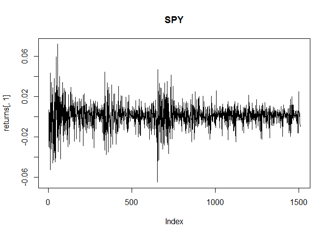 

```r
plot(returns[,2], type='l', main='TLT')
```

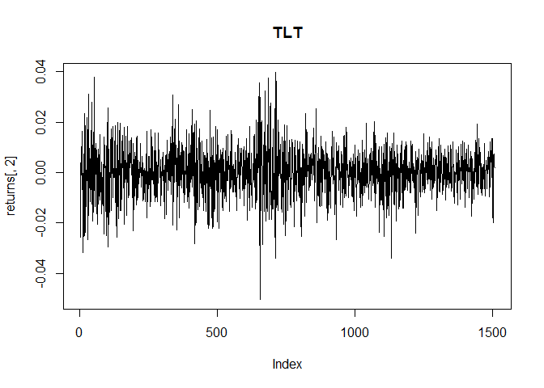 

```r
plot(returns[,3], type='l', main='LQD')
```

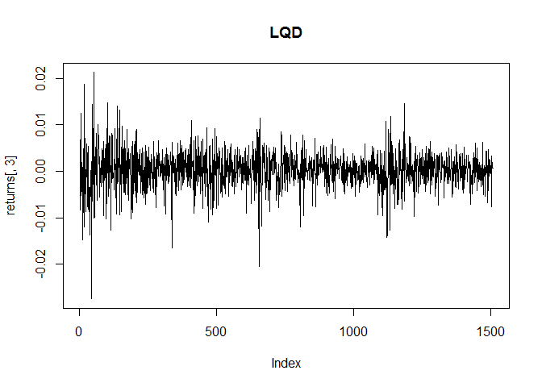 

```r
plot(returns[,4], type='l', main='EEM')
```

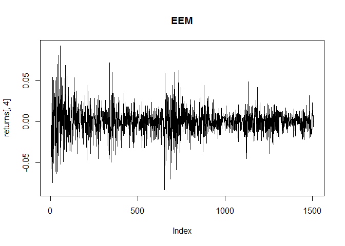 

```r
plot(returns[,5], type='l', main='VNQ')
```

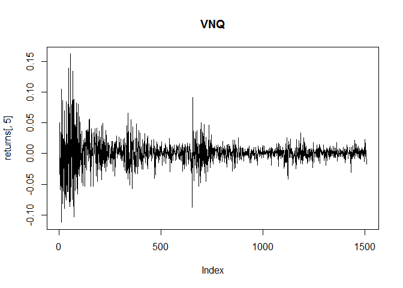 

VNQ and EEM have the highest standard devations of 0.020 and 0.017, respectively. These ETFs will be classified as 'risky'. SPY and TLT have lower standard deviations of 0.011 and 0.010 and will be classified as 'medium'. LQD has low return and the lowest standard deviation of 0.004 and will be classified as 'safe'.

Risky - VNQ: mean=0.09%, sd=0.020, EEM: mean=0.05%, sd=0.017  
Medium - SPY: mean=0.07%, sd=0.011, TLT: mean=0.02%, sd=0.010  
Safe - LQD: mean=0.03%, sd=0.004

```r
# Calculate and assess the mean and standard deviation of daily returns for each ETF
mu_SPY = mean(returns[,1])
sigma_SPY = sd(returns[,1])
mu_TLT = mean(returns[,2])
sigma_TLT = sd(returns[,2])
mu_LQD = mean(returns[,3])
sigma_LQD = sd(returns[,3])
mu_EEM = mean(returns[,4])
sigma_EEM = sd(returns[,4])
mu_VNQ = mean(returns[,5])
sigma_VNQ = sd(returns[,5])
```
4 weeks of return is simulated using bootstrap for an evenly split portfolio - 20% weight in each ETF.

```r
# Perform bootstrap 5000 times for even split portfolio
n_days = 20
set.seed(1234567)
sim_even = foreach(i=1:5000, .combine='rbind') %do% {
	totalwealth = 100000
	weights = c(0.2, 0.2, 0.2, 0.2, 0.2)
	holdings = weights * totalwealth
	wealthtracker = rep(0, n_days)
	for(today in 1:n_days) {
		return.today = resample(returns, 1, orig.ids=FALSE)
		holdings = holdings + holdings*return.today
		totalwealth = sum(holdings)
		wealthtracker[today] = totalwealth
		holdings = weights * totalwealth
	}
	wealthtracker
}
```
4 weeks of return is simulated using bootstrap for a "safe" portfolio - 20% weight on medium risk ETFs SPY and TLT, 60% weight on safe ETF LQD.

```r
# Perform bootstrap 5000 times for safe portfolio - 20% SPY, 20% TLT, 60% LQD
set.seed(1234567)
sim_safe = foreach(i=1:5000, .combine='rbind') %do% {
	totalwealth = 100000
	weights = c(0.2, 0.2, 0.6, 0.0, 0.0)
	holdings = weights * totalwealth
	wealthtracker = rep(0, n_days)
	for(today in 1:n_days) {
		return.today = resample(returns, 1, orig.ids=FALSE)
		holdings = holdings + holdings*return.today
		totalwealth = sum(holdings)
		wealthtracker[today] = totalwealth
		holdings = weights * totalwealth
	}
	wealthtracker
}
```
4 weeks of return is simulated using bootstrap for an "aggressive" portfolio - 20% weight on risky ETF EEM, 80% weight on risky ETF VNQ.

```r
# Perform bootstrap 5000 times for aggressive portfolio - 20% EEM, 80% VNQ
set.seed(1234567)
sim_aggressive = foreach(i=1:5000, .combine='rbind') %do% {
	totalwealth = 100000
	weights = c(0.0, 0.0, 0.0, 0.2, 0.8)
	holdings = weights * totalwealth
	wealthtracker = rep(0, n_days)
	for(today in 1:n_days) {
		return.today = resample(returns, 1, orig.ids=FALSE)
		holdings = holdings + holdings*return.today
		totalwealth = sum(holdings)
		wealthtracker[today] = totalwealth
		holdings = weights * totalwealth
	}
	wealthtracker
}
```


```r
# Compute average portfolio values of the 5000 simulations for each portfolio
avg_evensplit_return = mean(sim_even[,n_days])
avg_safe_return = mean(sim_safe[,n_days])
avg_aggressive_return = mean(sim_aggressive[,n_days])
```
Plotting the average 4-week returns for each portfolio type reveals that the aggressive portfolio yields the highest return on average followed by the even split portfolio and the safe portfolio.  
The even split portfolio yields 0.012 on average.  
The safe portfolio yields 0.007 on average.  
The aggressive portfolio yields 0.02 on average.

```r
# Plot the average portfolio values for each portfolio
plot(c(1,20), c(100000,avg_evensplit_return), type='l', col='#009E73', lwd=2, ylim=c(100000,103000), xlab='Days', ylab='Portfolio Value', main="Average 4-week return by Portfolio Type")
lines(c(1,20), c(100000, avg_safe_return),type='l', col='#56B4E9', lwd=2)
lines(c(1,20), c(100000,avg_aggressive_return), type='l', col='#E69F00', lwd=2)
legend('topright', c('Aggressive','Even Split','Safe'), col=c('#E69F00','#009E73','#56B4E9'), lwd=2, bty='n')
```

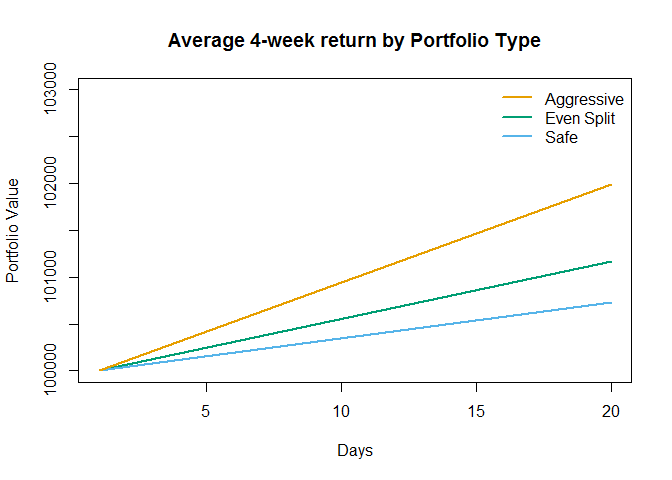 

However, the 4-week value at risk at the 5% level is $ -5041.60 for the even split portfolio, $ -2309.13 for the safe portfolio, and $ -11292.37 for the risky portfolio. Thus, the potential for greater returns comes at the cost of higher risk.

```r
# Calculate value at risk aat the 5% level for each portfolio
quantile(sim_even[,n_days], 0.05) - 100000
```

```
##        5% 
## -5041.596
```

```r
quantile(sim_safe[,n_days], 0.05) - 100000
```

```
##        5% 
## -2309.126
```

```r
quantile(sim_aggressive[,n_days], 0.05) - 100000
```

```
##        5% 
## -11292.37
```

```r
# Graph the return distribution for each portfolio
hist(sim_even[,n_days] - 100000, xlab='Portfolio Value', main='Distribution of Even Split Portfolio Returns')
```

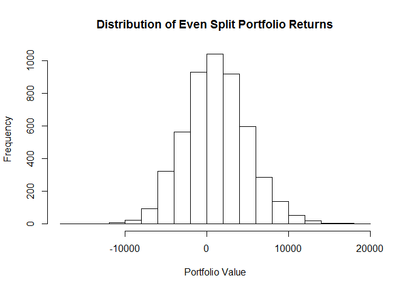 

```r
hist(sim_safe[,n_days] - 100000, xlab='Portfolio Value', main='Distribution of Safe Portfolio Returns')
```

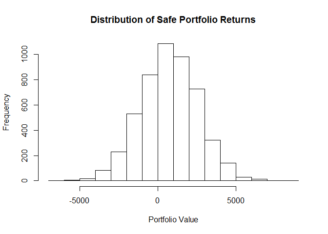 

```r
hist(sim_aggressive[,n_days]- 100000, xlab='Portfolio Value', main='Distribution of Aggressive Portfolio Returns')
```

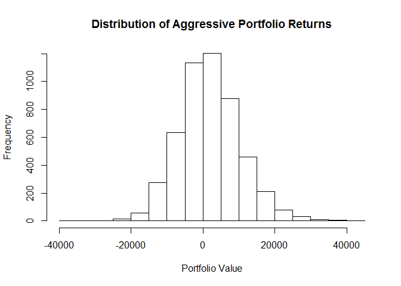 


Distinguishing Wines with Clustering and PCA
--------------------------------------------
Using data on 11 chemical properties of 6500 different bottles of vinho verde wine from northern Portugal, we will attempt to distinguish wine color and quality with clustering and principle component analysis.

```r
# Import libraries
library(ggplot2)
```


```r
# Import data
setwd("C:/Users/Julia Wu/Desktop/Predictive Models 2/STA380/data")
wine = read.csv("wine.csv")

# Check variables in wine
head(wine, 2)
```

```
##   fixed.acidity volatile.acidity citric.acid residual.sugar chlorides
## 1           7.4             0.70           0            1.9     0.076
## 2           7.8             0.88           0            2.6     0.098
##   free.sulfur.dioxide total.sulfur.dioxide density   pH sulphates alcohol
## 1                  11                   34  0.9978 3.51      0.56     9.4
## 2                  25                   67  0.9968 3.20      0.68     9.8
##   quality color
## 1       5   red
## 2       5   red
```

```r
# Remove quality and color
wine2 = wine[,1:11]
```
Run hierarchial clustering to distinguish red wines from white wines.

```r
# Center/scale the data
wine2_scaled <- scale(wine2, center=TRUE, scale=TRUE)

# Form a pairwise distance matrix using the dist function
wine2_distance_matrix = dist(wine2_scaled, method='euclidean')

# Run hierarchical clustering
hier_wine2 = hclust(wine2_distance_matrix, method='complete')

# Cut the tree into 10 clusters
cluster1 = cutree(hier_wine2, k=10)
summary(factor(cluster1))
```

```
##    1    2    3    4    5    6    7    8    9   10 
##  866 3899  128  128   22 1448    2    2    1    1
```
Reds and whites are separated fairly well across clusters except for cluster 2.

```r
# Examine the cluster members
summary(wine$color[which(cluster1 == 1)])
```

```
##   red white 
##   860     6
```

```r
summary(wine$color[which(cluster1 == 2)])
```

```
##   red white 
##   554  3345
```

```r
summary(wine$color[which(cluster1 == 3)])
```

```
##   red white 
##   127     1
```

```r
summary(wine$color[which(cluster1 == 4)])
```

```
##   red white 
##    26   102
```

```r
summary(wine$color[which(cluster1 == 5)])
```

```
##   red white 
##    22     0
```

```r
summary(wine$color[which(cluster1 == 6)])
```

```
##   red white 
##     8  1440
```

```r
summary(wine$color[which(cluster1 == 7)])
```

```
##   red white 
##     2     0
```

```r
summary(wine$color[which(cluster1 == 8)])
```

```
##   red white 
##     0     2
```

```r
summary(wine$color[which(cluster1 == 9)])
```

```
##   red white 
##     0     1
```

```r
summary(wine$color[which(cluster1 == 10)])
```

```
##   red white 
##     0     1
```
Run principal component analysis to distinguish red wines from white wines

```r
pc1 = prcomp(wine2, scale.=TRUE)
plot(pc1, main='Variance by PC')
```

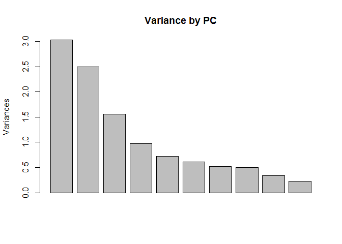 

PCA did well in distinguishing red wines from white wines. The plot shows two clear clusters separating reds from whites with only very few whites in the red cluster. It appears that PCA does better in distinguishing wine color than hierarchial clustering does.

```r
scores = pc1$x
qplot(scores[,1], scores[,2], color=wine$color, xlab='Component 1', ylab='Component 2')
```

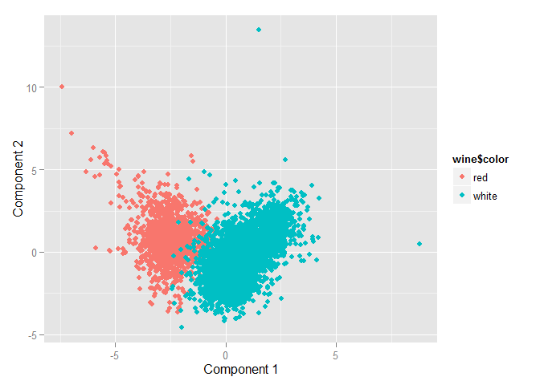 

Color coding the scores by quality, we see that some quality scores are centered around the same area, but the relationships aren't as clear. PCA isn't as effective in classifying wine quality. 

```r
qplot(scores[,1], scores[,2], color=as.factor(wine$quality), xlab='Component 1', ylab='Component 2')
```

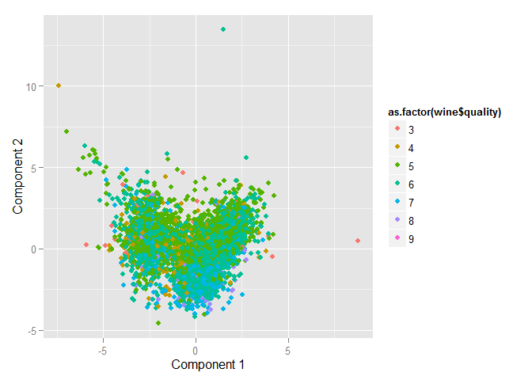 


Market Segmentation with PCA
----------------------------
The following uses principle component analysis to identify market segments using data from a large consumer brand's twitter following. Each row of data represents a twitter follower and the number of tweets they had related to a particular topic of interest. The segments are groups of interests that appear to stand out in the company's social-media audience.

```r
# Import libraries
library(flexclust)
library(ggplot2)
```


```r
# Import data
setwd("C:/Users/Julia Wu/Desktop/Predictive Models 2/STA380/data")
social = read.csv("social_marketing.csv",header=TRUE,row.names=1)

# Check variables in social
head(social, 2)
```

```
##           chatter current_events travel photo_sharing uncategorized
## hmjoe4g3k       2              0      2             2             2
## clk1m5w8s       3              3      2             1             1
##           tv_film sports_fandom politics food family home_and_garden music
## hmjoe4g3k       1             1        0    4      1               2     0
## clk1m5w8s       1             4        1    2      2               1     0
##           news online_gaming shopping health_nutrition college_uni
## hmjoe4g3k    0             0        1               17           0
## clk1m5w8s    0             0        0                0           0
##           sports_playing cooking eco computers business outdoors crafts
## hmjoe4g3k              2       5   1         1        0        2      1
## clk1m5w8s              1       0   0         0        1        0      2
##           automotive art religion beauty parenting dating school
## hmjoe4g3k          0   0        1      0         1      1      0
## clk1m5w8s          0   0        0      0         0      1      4
##           personal_fitness fashion small_business spam adult
## hmjoe4g3k               11       0              0    0     0
## clk1m5w8s                0       0              0    0     0
```

```r
# Remove chatter, uncategorized, spam, and adult
social = social[,c(-1,-5,-35,-36)]
```


```r
# Normalize phrase counts to phrase frequencies as a percentage
social_freq = social/rowSums(social)

# Run PCA
pc2 = prcomp(social_freq, scale=TRUE)
loadings = pc2$rotation
scores = pc2$x
plot(pc2, main='Variance by PC')
```

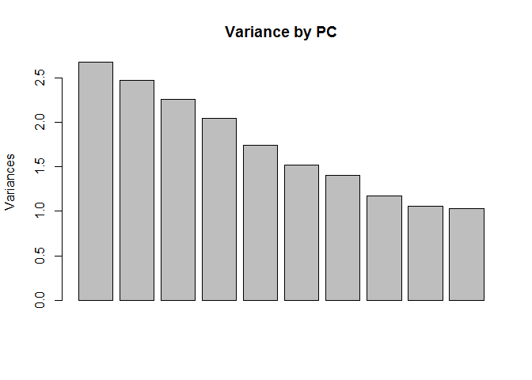 

We will consider up to PC7 since standard deviation drops to 1.08 at PC8. The 4 highest loadings for each PC up to PC7 will be used to define a market segment.

```r
summary(pc2)
```

```
## Importance of components:
##                           PC1     PC2     PC3     PC4     PC5     PC6
## Standard deviation     1.6366 1.57320 1.50429 1.43050 1.32049 1.23300
## Proportion of Variance 0.0837 0.07734 0.07072 0.06395 0.05449 0.04751
## Cumulative Proportion  0.0837 0.16104 0.23176 0.29571 0.35020 0.39771
##                            PC7     PC8     PC9    PC10    PC11   PC12
## Standard deviation     1.18549 1.08486 1.02671 1.01716 0.98981 0.9880
## Proportion of Variance 0.04392 0.03678 0.03294 0.03233 0.03062 0.0305
## Cumulative Proportion  0.44163 0.47840 0.51135 0.54368 0.57429 0.6048
##                          PC13    PC14    PC15    PC16    PC17   PC18
## Standard deviation     0.9863 0.97238 0.94951 0.93770 0.91073 0.8727
## Proportion of Variance 0.0304 0.02955 0.02817 0.02748 0.02592 0.0238
## Cumulative Proportion  0.6352 0.66474 0.69291 0.72039 0.74631 0.7701
##                           PC19    PC20   PC21    PC22    PC23   PC24
## Standard deviation     0.85447 0.84249 0.8295 0.80488 0.79901 0.7860
## Proportion of Variance 0.02282 0.02218 0.0215 0.02024 0.01995 0.0193
## Cumulative Proportion  0.79293 0.81511 0.8366 0.85685 0.87680 0.8961
##                           PC25    PC26    PC27    PC28    PC29    PC30
## Standard deviation     0.77692 0.76955 0.73881 0.68053 0.65295 0.59678
## Proportion of Variance 0.01886 0.01851 0.01706 0.01447 0.01332 0.01113
## Cumulative Proportion  0.91497 0.93348 0.95054 0.96501 0.97833 0.98946
##                           PC31      PC32
## Standard deviation     0.58075 1.014e-14
## Proportion of Variance 0.01054 0.000e+00
## Cumulative Proportion  1.00000 1.000e+00
```

```r
# Order the loadings ascending
o1 = order(loadings[,1])
o2 = order(loadings[,2])
o3 = order(loadings[,3])
o4 = order(loadings[,4])
o5 = order(loadings[,5])
o6 = order(loadings[,6])
o7 = order(loadings[,7])
o8 = order(loadings[,8])

# Return the top 4 variables with the highest loadings for each PC
colnames(social_freq)[tail(o1,4)]
```

```
## [1] "food"          "parenting"     "religion"      "sports_fandom"
```

```r
colnames(social_freq)[tail(o2,4)]
```

```
## [1] "food"             "outdoors"         "personal_fitness"
## [4] "health_nutrition"
```

```r
colnames(social_freq)[tail(o3,4)]
```

```
## [1] "photo_sharing" "cooking"       "beauty"        "fashion"
```

```r
colnames(social_freq)[tail(o4,4)]
```

```
## [1] "tv_film"        "sports_playing" "online_gaming"  "college_uni"
```

```r
colnames(social_freq)[tail(o5,4)]
```

```
## [1] "eco"            "current_events" "photo_sharing"  "shopping"
```

```r
colnames(social_freq)[tail(o6,4)]
```

```
## [1] "online_gaming" "shopping"      "photo_sharing" "automotive"
```

```r
colnames(social_freq)[tail(o7,4)]
```

```
## [1] "art"        "tv_film"    "news"       "automotive"
```

