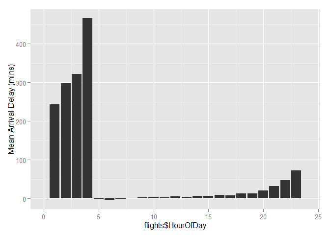
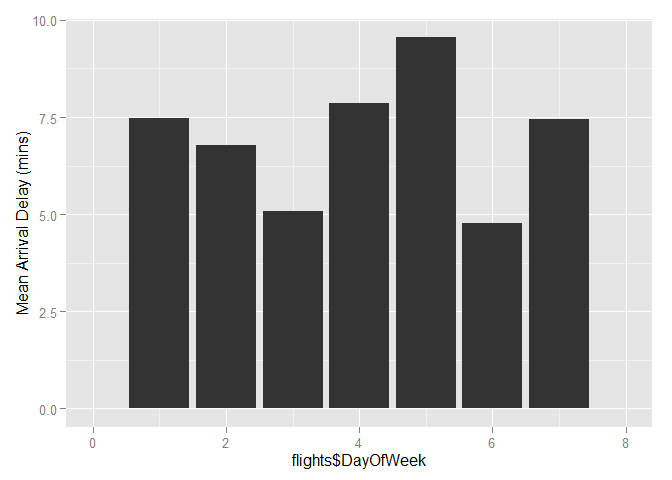
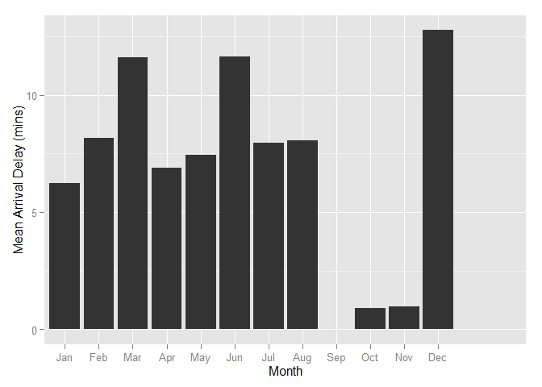

STA 380, Part 2: Exercises 2
============================

Flights at ABIA
---------------

The following graphs show average arrival delays in minutes by hour of day, day of week, and month of year, so that an individual can easily determine optimal times to fly to minimize delays.

```r
# Import library
library(ggplot2)
```


```r
# Read in data
setwd("C:/Users/Julia Wu/Desktop/Predictive Models 2/STA380/data")
flights = read.csv("ABIA.csv")
```


```r
# Check data
head(flights,5)
```

```
##   Year Month DayofMonth DayOfWeek DepTime CRSDepTime ArrTime CRSArrTime
## 1 2008     1          1         2     120       1935     309       2130
## 2 2008     1          1         2     555        600     826        835
## 3 2008     1          1         2     600        600     728        729
## 4 2008     1          1         2     601        605     727        750
## 5 2008     1          1         2     601        600     654        700
##   UniqueCarrier FlightNum TailNum ActualElapsedTime CRSElapsedTime AirTime
## 1            9E      5746  84129E               109            115      88
## 2            AA      1614  N438AA               151            155     133
## 3            YV      2883  N922FJ               148            149     125
## 4            9E      5743  89189E                86            105      70
## 5            AA      1157  N4XAAA                53             60      38
##   ArrDelay DepDelay Origin Dest Distance TaxiIn TaxiOut Cancelled
## 1      339      345    MEM  AUS      559      3      18         0
## 2       -9       -5    AUS  ORD      978      7      11         0
## 3       -1        0    AUS  PHX      872      7      16         0
## 4      -23       -4    AUS  MEM      559      4      12         0
## 5       -6        1    AUS  DFW      190      5      10         0
##   CancellationCode Diverted CarrierDelay WeatherDelay NASDelay
## 1                         0          339            0        0
## 2                         0           NA           NA       NA
## 3                         0           NA           NA       NA
## 4                         0           NA           NA       NA
## 5                         0           NA           NA       NA
##   SecurityDelay LateAircraftDelay
## 1             0                 0
## 2            NA                NA
## 3            NA                NA
## 4            NA                NA
## 5            NA                NA
```

```r
# Extract Hour of Day
flights$HourOfDay = as.numeric(substr(flights$DepTime, 1, nchar(flights$DepTime)-2))

# Create a binary arrival delay column
flights$Delay <- ifelse(flights$ArrDelay < 0, 1, ifelse(flights$ArrDelay >= 0, "0", "NA"))

# Plot average delays by hour of day
ggplot(data = flights, aes(flights$HourOfDay, flights$ArrDelay)) + stat_summary(fun.y = mean, geom = "bar") + scale_x_discrete("Hour of Day", breaks=1:24, limits=c(0,1,2,3,4,5,6,7,8,9,10,11,12,13,14,15,16,17,18,19,20,21,22,23,24,25)) + xlim(0,24) + scale_y_continuous("Mean Arrival Delay (mins)")
```

 

```r
# Plot average delays by day of week
ggplot(data = flights, aes(flights$DayOfWeek, flights$ArrDelay)) + stat_summary(fun.y = mean, geom = "bar") + scale_x_discrete("Day of Week", breaks=1:7, labels=c("Mon","Tue","Wed","Thu","Fri","Sat","Sun")) + xlim(0,8) + scale_y_continuous("Mean Arrival Delay (mins)")
```

 

```r
# Plot average delays by month of year
ggplot(data = flights, aes(flights$Month, flights$ArrDelay)) + stat_summary(fun.y = mean, geom = "bar") + scale_x_discrete("Month", breaks=1:12, labels=c("Jan", "Feb", "Mar", "Apr", "May", "Jun", "Jul", "Aug", "Sep", "Oct", "Nov", "Dec")) + scale_y_continuous("Mean Arrival Delay (mins)")
```

 


Author Attribution
------------------

In the following, we will fit a Naive Bayes model and a Principal Component Regression model to 50 articles from 50 different authors to predict the author of a test set of articles on the basis of its textual content.

```r
# Import libraries
library(tm)
library(SnowballC)
library(plyr)
```


```r
# Reader function that specifies English
readerPlain = function(fname){
				readPlain(elem=list(content=readLines(fname)), 
							id=fname, language='en')}
```
First, we read the training data in and create a corpus.

```r
# Roll directories together into a single corpus
setwd("C:/Users/Julia Wu/Desktop/Predictive Models 2/STA380/data")
author_dirs = Sys.glob('../data/ReutersC50/C50train/*')

# Loop through author_dirs to get the files and the authors
file_list = c()
labels = c()
for(author in author_dirs) {
	author_name = substring(author, first=29)
	files_to_add = Sys.glob(paste0(author, '/*.txt'))
	file_list = append(file_list, files_to_add)
	labels = append(labels, rep(author_name, length(files_to_add)))
}

# Read in file_list and remove .txt from the file name
all_docs = lapply(file_list, readerPlain) 
names(all_docs) = file_list
names(all_docs) = sub('.txt', '', names(all_docs))

# Create a corpus of documents with the author's name as the document name
my_corpus = Corpus(VectorSource(all_docs))
names(my_corpus) = labels
```
Then we preprocess the data by setting all the words to lowercase, removing numbers, removing punctuation, stripping the words of white space, removing stop words, and combining stem words.

```r
# Preprocess the data
my_corpus = tm_map(my_corpus, content_transformer(tolower)) # make everything lowercase
my_corpus = tm_map(my_corpus, content_transformer(removeNumbers)) # remove numbers
my_corpus = tm_map(my_corpus, content_transformer(removePunctuation)) # remove punctuation
my_corpus = tm_map(my_corpus, content_transformer(stripWhitespace)) # remove excess white-space
my_corpus = tm_map(my_corpus, content_transformer(removeWords), stopwords("SMART")) # remove stop words
my_corpus = tm_map(my_corpus, stemDocument) # combine stem words
```
Next, we convert the corpus into a document term matrix (DTM). The summary statistics show that the DTM has 99% sparsity. Running the models with and without removing sparse terms reveals that not removing sparse terms yields higher acccuracy. However, the difference is marginal, so we will remove sparse terms to make the data more manageable.

```r
# Create a document term matrix
DTM = DocumentTermMatrix(my_corpus)

# Basic summary statistics
DTM
```

```
## <<DocumentTermMatrix (documents: 2500, terms: 21542)>>
## Non-/sparse entries: 388227/53466773
## Sparsity           : 99%
## Maximal term length: 36
## Weighting          : term frequency (tf)
```

```r
# Change it to a special kind of sparse matrix format
class(DTM)
```

```
## [1] "DocumentTermMatrix"    "simple_triplet_matrix"
```

```r
# Remove sparse terms
DTM = removeSparseTerms(DTM, 0.9953)
DTM
```

```
## <<DocumentTermMatrix (documents: 2500, terms: 3972)>>
## Non-/sparse entries: 342105/9587895
## Sparsity           : 97%
## Maximal term length: 20
## Weighting          : term frequency (tf)
```

```r
# Create a dense matrix
X = as.matrix(DTM)
```
We then perform the same steps to read in the test data.

```r
# Roll directories together into a single corpus
author_dirs_test = Sys.glob('../data/ReutersC50/C50test/*')

# Loop through author_dirs to get the files and the authors
file_list_test = NULL
labels_test = NULL
for(author_test in author_dirs_test) {
	author_name_test = substring(author_test, first=28)
	files_to_add_test = Sys.glob(paste0(author_test, '/*.txt'))
	file_list_test = append(file_list_test, files_to_add_test)
	labels_test = append(labels_test, rep(author_name_test, length(files_to_add_test)))
}

# Read in file_list and remove .txt from the file name
all_docs_test = lapply(file_list_test, readerPlain) 
names(all_docs_test) = file_list_test
names(all_docs_test) = sub('.txt', '', names(all_docs_test))

# Create a corpus of documents with the author's name as the document name
my_corpus_test = Corpus(VectorSource(all_docs_test))
names(my_corpus_test) = labels_test

# Preprocess the data
my_corpus_test = tm_map(my_corpus_test, content_transformer(tolower)) # make everything lowercase
my_corpus_test = tm_map(my_corpus_test, content_transformer(removeNumbers)) # remove numbers
my_corpus_test = tm_map(my_corpus_test, content_transformer(removePunctuation)) # remove punctuation
my_corpus_test = tm_map(my_corpus_test, content_transformer(stripWhitespace)) # remove excess white-space
my_corpus_test = tm_map(my_corpus_test, content_transformer(removeWords), stopwords("SMART")) # remove stop words
my_corpus_test = tm_map(my_corpus_test, stemDocument) # combine stem words

# Create a document term matrix
DTM_test = DocumentTermMatrix(my_corpus_test)

# Basic summary statistics
DTM_test
```

```
## <<DocumentTermMatrix (documents: 2500, terms: 22088)>>
## Non-/sparse entries: 394051/54825949
## Sparsity           : 99%
## Maximal term length: 45
## Weighting          : term frequency (tf)
```

```r
# Change it to a special kind of sparse matrix format
class(DTM_test)
```

```
## [1] "DocumentTermMatrix"    "simple_triplet_matrix"
```

```r
# Remove sparse terms
DTM_test = removeSparseTerms(DTM_test, 0.9953)
DTM_test
```

```
## <<DocumentTermMatrix (documents: 2500, terms: 4041)>>
## Non-/sparse entries: 347329/9755171
## Sparsity           : 97%
## Maximal term length: 19
## Weighting          : term frequency (tf)
```

```r
# Create a dense matrix
X_test = as.matrix(DTM_test)
```
Next, to make sure our matrices match up, we need to account for words that are in training but aren't in test and words that are in test but aren't in training. We will add columns into the test matrix for words that are in training but aren't in test and remove words that are in test but aren't in training. While words in test that aren't in training could provide additional insight for author prediction, it is common practice to ignore them in order to simplify the process.

```r
# Get the list of words in the training set
X_words = colnames(X)

# Get the list of words in the test set
X_test_words = colnames(X_test)

# Create 2 empty vectors to store words to add to test and words to drop from test
test_add = vector(length=0)
test_drop = vector(length=0)

# Loop through the test words and add those not in the train to the vector test_drop
for (test_word in X_test_words) {
  if (!test_word %in% X_words) {
    test_drop <- c(test_drop, test_word)
  }
}

# Loop through the train words and add those not in test to the vector test_add
for (word in X_words) {
  if (!word %in% X_test_words) {
    test_add <- c(test_add, word)
  }
}

# Create a matrix of 0's to insert into the test matrix
zero <- matrix(0, nrow = nrow(X), ncol=length(test_add))

# Name the columns using the words in test_add
colnames(zero) <- test_add

# Add the zero matrix to the test matrix
X2_test = cbind(X_test, zero)

# Sort the columns alphabetically so they match the X2
X2_test = X2_test[,order(colnames(X2_test))]

# Drop the words in test_drop from the test matrix
X2_test = X2_test[,!colnames(X2_test) %in% test_drop]
```
Next, we perform Naive Bayes by creating a dense matrix and calculating multinomial probability vectors for each author using Laplace smoothing.

```r
# Create a dense matrix
X = as.matrix(DTM)

# Calculate the smoothing factor
smooth_count = 1/nrow(X)

# Add the smoothing factor and aggregate the word counts + smoothing factor for each author
by_word_wc = rowsum(X + smooth_count, labels)

# Sum the word counts + smoothing factor for each word for each author
total_wc = rowSums(by_word_wc)

# Divide by_word_wc by total_wc to get the multinomial probability vector
w = by_word_wc / total_wc

# Log the vector for easier interpretability
w = log(w)

# Set X2 equal to the multinomial probability vector w
X2 = w
```
We then multiply the test matrix by the multinomial probability vector. The column name of the largest value for each document gives us the prediction.

```r
# Transpose the multinomial probability vector for matrix multiplication
X2 = t(X2)

# Multiply the test matrix by X2
log_prob = X2_test %*% X2

# Get the prediction by return the column name of the max value for each document 
predict = colnames(log_prob)[max.col(log_prob)]

# Add the prediction the the matrix
log_prob = cbind(log_prob, predict)

# Create a column that checks the prediction against the actual
accurate = as.integer(rownames(log_prob) == log_prob[,51])

# Create a dataframe that includes the actual, prediction, and accuracy
nb_results = cbind.data.frame(rownames(log_prob), predict, accurate)
```
The Naive Bayes model results in an overall prediction accuracy of 63.52%. Some authors have higher prediction accuracies than other. Aaron Pressman, for example, has a prediction accuracy of 94%. Whereas other authors such as Benjamin Kang Lim are harder to identify. Benjamin has a 26% prediction accuracy and is confused with Jane Macarteny 26% of the time. David Lawder also has a low prediction accuracy of 14% and is confused with Todd Nissen 50% of the time. Looking at David Lawder and Tom Nissen's documents, the association makes sense since both authors write about the auto industry.

```r
# Return the total accuracy
mean(accurate)
```

```
## [1] 0.6352
```

```r
# Add column names to dataframe
colnames(nb_results) <- c("Actual","Prediction","Accuracy")

# Create a summary of each actual and prediction combination with the number of instances (n) and the percentage of that outcome occuring for each author
length <- ddply(nb_results, .(Actual), transform, sum.n = length(Actual))
table <- ddply(length, .(Actual, Prediction), summarise, n=length(Prediction), percentage=n / sum.n[1] * 100)
table
```

```
##                Actual        Prediction  n percentage
## 1       AaronPressman     AaronPressman 47         94
## 2       AaronPressman       BradDorfman  1          2
## 3       AaronPressman  DarrenSchuettler  1          2
## 4       AaronPressman       SamuelPerry  1          2
## 5          AlanCrosby        AlanCrosby 28         56
## 6          AlanCrosby        JanLopatka  6         12
## 7          AlanCrosby      JohnMastrini 12         24
## 8          AlanCrosby         KeithWeir  1          2
## 9          AlanCrosby        PierreTran  3          6
## 10     AlexanderSmith    AlexanderSmith 22         44
## 11     AlexanderSmith          JoeOrtiz 23         46
## 12     AlexanderSmith      JonathanBirt  1          2
## 13     AlexanderSmith       SamuelPerry  1          2
## 14     AlexanderSmith       SimonCowell  3          6
## 15    BenjaminKangLim   BenjaminKangLim 13         26
## 16    BenjaminKangLim    GrahamEarnshaw  2          4
## 17    BenjaminKangLim     JaneMacartney 13         26
## 18    BenjaminKangLim        MureDickie  2          4
## 19    BenjaminKangLim     PeterHumphrey  3          6
## 20    BenjaminKangLim       ScottHillis  8         16
## 21    BenjaminKangLim      WilliamKazer  9         18
## 22      BernardHickey    AlexanderSmith  1          2
## 23      BernardHickey     BernardHickey 30         60
## 24      BernardHickey       BradDorfman  2          4
## 25      BernardHickey  HeatherScoffield  2          4
## 26      BernardHickey     KevinMorrison  3          6
## 27      BernardHickey   LynnleyBrowning  1          2
## 28      BernardHickey      MarkBendeich  7         14
## 29      BernardHickey       SamuelPerry  2          4
## 30      BernardHickey      SarahDavison  2          4
## 31        BradDorfman       BradDorfman 37         74
## 32        BradDorfman       EricAuchard  2          4
## 33        BradDorfman    KevinDrawbaugh  6         12
## 34        BradDorfman        MartinWolk  1          2
## 35        BradDorfman        RobinSidel  1          2
## 36        BradDorfman    TheresePoletti  2          4
## 37        BradDorfman        ToddNissen  1          2
## 38   DarrenSchuettler   BenjaminKangLim  1          2
## 39   DarrenSchuettler  DarrenSchuettler 12         24
## 40   DarrenSchuettler  HeatherScoffield 36         72
## 41   DarrenSchuettler       ScottHillis  1          2
## 42        DavidLawder       BradDorfman  7         14
## 43        DavidLawder       DavidLawder  7         14
## 44        DavidLawder    KevinDrawbaugh  4          8
## 45        DavidLawder   PatriciaCommins  3          6
## 46        DavidLawder        RobinSidel  4          8
## 47        DavidLawder        ToddNissen 25         50
## 48      EdnaFernandes    AlexanderSmith  1          2
## 49      EdnaFernandes     EdnaFernandes 26         52
## 50      EdnaFernandes      JonathanBirt  4          8
## 51      EdnaFernandes    JoWinterbottom  3          6
## 52      EdnaFernandes     KirstinRidley  4          8
## 53      EdnaFernandes        PierreTran  5         10
## 54      EdnaFernandes        TimFarrand  1          2
## 55      EdnaFernandes        ToddNissen  6         12
## 56        EricAuchard       EricAuchard 28         56
## 57        EricAuchard    KevinDrawbaugh  2          4
## 58        EricAuchard     KirstinRidley  2          4
## 59        EricAuchard KouroshKarimkhany  1          2
## 60        EricAuchard         NickLouth  9         18
## 61        EricAuchard      RogerFillion  1          2
## 62        EricAuchard       SamuelPerry  3          6
## 63        EricAuchard    TheresePoletti  4          8
## 64     FumikoFujisaki    FumikoFujisaki 46         92
## 65     FumikoFujisaki      SarahDavison  3          6
## 66     FumikoFujisaki        ToddNissen  1          2
## 67     GrahamEarnshaw    GrahamEarnshaw 39         78
## 68     GrahamEarnshaw     JaneMacartney  1          2
## 69     GrahamEarnshaw      JimGilchrist  1          2
## 70     GrahamEarnshaw        MureDickie  1          2
## 71     GrahamEarnshaw      SarahDavison  4          8
## 72     GrahamEarnshaw       ScottHillis  1          2
## 73     GrahamEarnshaw      WilliamKazer  3          6
## 74   HeatherScoffield  DarrenSchuettler  6         12
## 75   HeatherScoffield  HeatherScoffield 20         40
## 76   HeatherScoffield     JaneMacartney  5         10
## 77   HeatherScoffield      JohnMastrini  1          2
## 78   HeatherScoffield   LynnleyBrowning  1          2
## 79   HeatherScoffield      MarkBendeich  2          4
## 80   HeatherScoffield     PeterHumphrey  6         12
## 81   HeatherScoffield       SamuelPerry  1          2
## 82   HeatherScoffield       ScottHillis  3          6
## 83   HeatherScoffield      WilliamKazer  5         10
## 84      JaneMacartney   BenjaminKangLim  3          6
## 85      JaneMacartney    GrahamEarnshaw  2          4
## 86      JaneMacartney     JaneMacartney 15         30
## 87      JaneMacartney        MureDickie  3          6
## 88      JaneMacartney       ScottHillis 24         48
## 89      JaneMacartney      WilliamKazer  3          6
## 90         JanLopatka        JanLopatka 27         54
## 91         JanLopatka      JohnMastrini 20         40
## 92         JanLopatka        MartinWolk  2          4
## 93         JanLopatka        ToddNissen  1          2
## 94       JimGilchrist      JimGilchrist 50        100
## 95           JoeOrtiz    AlexanderSmith  3          6
## 96           JoeOrtiz     BernardHickey  1          2
## 97           JoeOrtiz     EdnaFernandes  1          2
## 98           JoeOrtiz          JoeOrtiz 35         70
## 99           JoeOrtiz     KevinMorrison  1          2
## 100          JoeOrtiz     KirstinRidley  1          2
## 101          JoeOrtiz       SimonCowell  8         16
## 102      JohnMastrini        JanLopatka 12         24
## 103      JohnMastrini      JohnMastrini 35         70
## 104      JohnMastrini       KarlPenhaul  1          2
## 105      JohnMastrini        PierreTran  1          2
## 106      JohnMastrini        ToddNissen  1          2
## 107      JonathanBirt          JoeOrtiz  1          2
## 108      JonathanBirt      JonathanBirt 41         82
## 109      JonathanBirt    KevinDrawbaugh  2          4
## 110      JonathanBirt     KirstinRidley  3          6
## 111      JonathanBirt   LynnleyBrowning  1          2
## 112      JonathanBirt        TimFarrand  2          4
## 113    JoWinterbottom    AlexanderSmith  6         12
## 114    JoWinterbottom          JoeOrtiz  1          2
## 115    JoWinterbottom      JonathanBirt  1          2
## 116    JoWinterbottom    JoWinterbottom 35         70
## 117    JoWinterbottom        TimFarrand  7         14
## 118       KarlPenhaul       KarlPenhaul 50        100
## 119         KeithWeir     EdnaFernandes  3          6
## 120         KeithWeir      JonathanBirt  3          6
## 121         KeithWeir         KeithWeir 41         82
## 122         KeithWeir     KirstinRidley  1          2
## 123         KeithWeir     PeterHumphrey  1          2
## 124         KeithWeir        TimFarrand  1          2
## 125    KevinDrawbaugh       BradDorfman  2          4
## 126    KevinDrawbaugh    KevinDrawbaugh 37         74
## 127    KevinDrawbaugh        MartinWolk  1          2
## 128    KevinDrawbaugh     MichaelConnor  1          2
## 129    KevinDrawbaugh   PatriciaCommins  8         16
## 130    KevinDrawbaugh        RobinSidel  1          2
## 131     KevinMorrison     BernardHickey  7         14
## 132     KevinMorrison         KeithWeir  1          2
## 133     KevinMorrison     KevinMorrison 26         52
## 134     KevinMorrison     KirstinRidley  1          2
## 135     KevinMorrison      MarkBendeich  7         14
## 136     KevinMorrison     MichaelConnor  1          2
## 137     KevinMorrison      SarahDavison  6         12
## 138     KevinMorrison        TimFarrand  1          2
## 139     KirstinRidley     AaronPressman  2          4
## 140     KirstinRidley    AlexanderSmith  2          4
## 141     KirstinRidley      JonathanBirt  1          2
## 142     KirstinRidley         KeithWeir  7         14
## 143     KirstinRidley     KirstinRidley 32         64
## 144     KirstinRidley     MichaelConnor  1          2
## 145     KirstinRidley         NickLouth  1          2
## 146     KirstinRidley      SarahDavison  1          2
## 147     KirstinRidley    TheresePoletti  2          4
## 148     KirstinRidley        TimFarrand  1          2
## 149 KouroshKarimkhany       EricAuchard  9         18
## 150 KouroshKarimkhany KouroshKarimkhany 40         80
## 151 KouroshKarimkhany         NickLouth  1          2
## 152         LydiaZajc       BradDorfman  4          8
## 153         LydiaZajc  DarrenSchuettler  6         12
## 154         LydiaZajc       EricAuchard  2          4
## 155         LydiaZajc         LydiaZajc 31         62
## 156         LydiaZajc     MichaelConnor  2          4
## 157         LydiaZajc       SamuelPerry  3          6
## 158         LydiaZajc      SarahDavison  1          2
## 159         LydiaZajc        ToddNissen  1          2
## 160    LynneO'Donnell    GrahamEarnshaw  1          2
## 161    LynneO'Donnell     JaneMacartney  3          6
## 162    LynneO'Donnell    LynneO'Donnell 38         76
## 163    LynneO'Donnell      MarkBendeich  2          4
## 164    LynneO'Donnell        MureDickie  2          4
## 165    LynneO'Donnell      SarahDavison  1          2
## 166    LynneO'Donnell       ScottHillis  1          2
## 167    LynneO'Donnell          TanEeLyn  1          2
## 168    LynneO'Donnell        ToddNissen  1          2
## 169   LynnleyBrowning   LynnleyBrowning 50        100
## 170   MarcelMichelson       EricAuchard  2          4
## 171   MarcelMichelson      JonathanBirt  5         10
## 172   MarcelMichelson    KevinDrawbaugh  2          4
## 173   MarcelMichelson     KirstinRidley  1          2
## 174   MarcelMichelson   LynnleyBrowning  4          8
## 175   MarcelMichelson   MarcelMichelson 35         70
## 176   MarcelMichelson       SamuelPerry  1          2
## 177      MarkBendeich    AlexanderSmith  1          2
## 178      MarkBendeich     BernardHickey  1          2
## 179      MarkBendeich  DarrenSchuettler  1          2
## 180      MarkBendeich  HeatherScoffield  2          4
## 181      MarkBendeich     JaneMacartney  1          2
## 182      MarkBendeich     KevinMorrison 11         22
## 183      MarkBendeich      MarkBendeich 26         52
## 184      MarkBendeich        MureDickie  1          2
## 185      MarkBendeich      SarahDavison  3          6
## 186      MarkBendeich       ScottHillis  1          2
## 187      MarkBendeich        ToddNissen  2          4
## 188        MartinWolk     AaronPressman  1          2
## 189        MartinWolk       BradDorfman  3          6
## 190        MartinWolk       EricAuchard  1          2
## 191        MartinWolk      JonathanBirt  1          2
## 192        MartinWolk       KarlPenhaul  1          2
## 193        MartinWolk    KevinDrawbaugh  1          2
## 194        MartinWolk        MartinWolk 32         64
## 195        MartinWolk   PatriciaCommins  1          2
## 196        MartinWolk       SamuelPerry  9         18
## 197      MatthewBunce  HeatherScoffield  3          6
## 198      MatthewBunce       KarlPenhaul  1          2
## 199      MatthewBunce      MatthewBunce 44         88
## 200      MatthewBunce       ScottHillis  1          2
## 201      MatthewBunce      WilliamKazer  1          2
## 202     MichaelConnor    AlexanderSmith  3          6
## 203     MichaelConnor          JoeOrtiz  1          2
## 204     MichaelConnor     MichaelConnor 44         88
## 205     MichaelConnor        RobinSidel  1          2
## 206     MichaelConnor       SamuelPerry  1          2
## 207        MureDickie    GrahamEarnshaw  2          4
## 208        MureDickie     JaneMacartney  6         12
## 209        MureDickie    LynneO'Donnell  1          2
## 210        MureDickie   LynnleyBrowning  1          2
## 211        MureDickie        MureDickie 17         34
## 212        MureDickie     PeterHumphrey  3          6
## 213        MureDickie        PierreTran  1          2
## 214        MureDickie      SarahDavison  1          2
## 215        MureDickie       ScottHillis  6         12
## 216        MureDickie          TanEeLyn  1          2
## 217        MureDickie      WilliamKazer 11         22
## 218         NickLouth       EricAuchard  3          6
## 219         NickLouth     KirstinRidley  1          2
## 220         NickLouth      MarkBendeich  1          2
## 221         NickLouth        MartinWolk  1          2
## 222         NickLouth         NickLouth 40         80
## 223         NickLouth   PatriciaCommins  2          4
## 224         NickLouth      RogerFillion  1          2
## 225         NickLouth       SamuelPerry  1          2
## 226   PatriciaCommins       BradDorfman  4          8
## 227   PatriciaCommins    KevinDrawbaugh  6         12
## 228   PatriciaCommins     MichaelConnor  1          2
## 229   PatriciaCommins   PatriciaCommins 34         68
## 230   PatriciaCommins       SamuelPerry  2          4
## 231   PatriciaCommins       SimonCowell  1          2
## 232   PatriciaCommins        TimFarrand  1          2
## 233   PatriciaCommins        ToddNissen  1          2
## 234     PeterHumphrey    AlexanderSmith  1          2
## 235     PeterHumphrey     JaneMacartney  1          2
## 236     PeterHumphrey      JimGilchrist  1          2
## 237     PeterHumphrey        MureDickie  1          2
## 238     PeterHumphrey     PeterHumphrey 31         62
## 239     PeterHumphrey      SarahDavison  1          2
## 240     PeterHumphrey          TanEeLyn 14         28
## 241        PierreTran    AlexanderSmith  1          2
## 242        PierreTran     EdnaFernandes  1          2
## 243        PierreTran   MarcelMichelson 13         26
## 244        PierreTran        MartinWolk  2          4
## 245        PierreTran        PierreTran 32         64
## 246        PierreTran        TimFarrand  1          2
## 247        RobinSidel       BradDorfman  2          4
## 248        RobinSidel       EricAuchard  1          2
## 249        RobinSidel    KevinDrawbaugh  2          4
## 250        RobinSidel      MarkBendeich  1          2
## 251        RobinSidel        MartinWolk  1          2
## 252        RobinSidel        RobinSidel 43         86
## 253      RogerFillion     AaronPressman  2          4
## 254      RogerFillion       EricAuchard  1          2
## 255      RogerFillion     MichaelConnor  2          4
## 256      RogerFillion         NickLouth  2          4
## 257      RogerFillion      RogerFillion 40         80
## 258      RogerFillion       ScottHillis  3          6
## 259       SamuelPerry     AaronPressman  1          2
## 260       SamuelPerry       EricAuchard  9         18
## 261       SamuelPerry    KevinDrawbaugh  1          2
## 262       SamuelPerry KouroshKarimkhany  2          4
## 263       SamuelPerry       SamuelPerry 29         58
## 264       SamuelPerry    TheresePoletti  8         16
## 265      SarahDavison      JimGilchrist  2          4
## 266      SarahDavison        MureDickie  1          2
## 267      SarahDavison     PeterHumphrey 12         24
## 268      SarahDavison      SarahDavison 29         58
## 269      SarahDavison       ScottHillis  1          2
## 270      SarahDavison          TanEeLyn  5         10
## 271       ScottHillis     JaneMacartney 19         38
## 272       ScottHillis       KarlPenhaul  1          2
## 273       ScottHillis    LynneO'Donnell  1          2
## 274       ScottHillis        MureDickie  4          8
## 275       ScottHillis     PeterHumphrey  4          8
## 276       ScottHillis       ScottHillis 16         32
## 277       ScottHillis          TanEeLyn  3          6
## 278       ScottHillis      WilliamKazer  2          4
## 279       SimonCowell    AlexanderSmith  8         16
## 280       SimonCowell          JoeOrtiz  6         12
## 281       SimonCowell     MichaelConnor  1          2
## 282       SimonCowell      SarahDavison  1          2
## 283       SimonCowell       SimonCowell 33         66
## 284       SimonCowell        TimFarrand  1          2
## 285          TanEeLyn    GrahamEarnshaw  1          2
## 286          TanEeLyn        MureDickie  1          2
## 287          TanEeLyn     PeterHumphrey 18         36
## 288          TanEeLyn      SarahDavison 12         24
## 289          TanEeLyn       ScottHillis  2          4
## 290          TanEeLyn          TanEeLyn 16         32
## 291    TheresePoletti       EricAuchard 10         20
## 292    TheresePoletti       SamuelPerry  7         14
## 293    TheresePoletti    TheresePoletti 33         66
## 294        TimFarrand       BradDorfman  1          2
## 295        TimFarrand      JonathanBirt  3          6
## 296        TimFarrand         KeithWeir  2          4
## 297        TimFarrand   LynnleyBrowning  1          2
## 298        TimFarrand     MichaelConnor  1          2
## 299        TimFarrand         NickLouth  1          2
## 300        TimFarrand       SimonCowell  3          6
## 301        TimFarrand        TimFarrand 38         76
## 302        ToddNissen       BradDorfman  3          6
## 303        ToddNissen       DavidLawder 12         24
## 304        ToddNissen       KarlPenhaul  5         10
## 305        ToddNissen    KevinDrawbaugh  1          2
## 306        ToddNissen     MichaelConnor  4          8
## 307        ToddNissen      SarahDavison  1          2
## 308        ToddNissen       ScottHillis  2          4
## 309        ToddNissen        ToddNissen 22         44
## 310      WilliamKazer   BenjaminKangLim  5         10
## 311      WilliamKazer    FumikoFujisaki  1          2
## 312      WilliamKazer    GrahamEarnshaw  3          6
## 313      WilliamKazer     JaneMacartney  7         14
## 314      WilliamKazer    LynneO'Donnell  1          2
## 315      WilliamKazer        MureDickie  3          6
## 316      WilliamKazer     PeterHumphrey  2          4
## 317      WilliamKazer      SarahDavison  2          4
## 318      WilliamKazer       ScottHillis  6         12
## 319      WilliamKazer          TanEeLyn  4          8
## 320      WilliamKazer      WilliamKazer 16         32
```
Next we run Principal Component Analysis with Multinomial Regression.

```r
# Import libraries
library(glmnet)
library(nnet)
```
PCR using the first 500 principal components yields similar results to Naive Bayes with a slightly higher prediction accuracy of 65.52%.

```r
# Set A = training DTM
A = X

# Set b = actual author names
b = rownames(X)

# Run PCA scaled
pc_words = prcomp(A, scale=TRUE)

# Check how many principal components
dim(pc_words$rotation)
```

```
## [1] 3972 2500
```

```r
# Calculate scores
K = 500
V = pc_words$rotation[,1:K]
scores = A %*% V

# Calculate test alphas
test_X = X2_test %*% V

# Set train x and train y
train_X = scores
train_y = rownames(scores)

# Run multinomial regression
multi = glmnet(x=train_X, y=train_y, alpha=0, family="multinomial")

# Predict
predict = predict(multi, newx=test_X, type="class", s=0)

# Check accuracy
multi_accuracy = as.integer(predict == rownames(X2_test))

# Return the total accuracy
mean(multi_accuracy)
```

```
## [1] 0.6552
```

```r
# Create dataframe of actual, prediction, and accuracy
pcr_results = cbind.data.frame(rownames(X2_test), predict, multi_accuracy)
colnames(pcr_results) = c("Actual", "Prediction", "Accuracy")

# Create a summary of each actual and prediction combination with the number of instances (n) and the percentage of that outcome occuring for each author
length <- ddply(pcr_results, .(Actual), transform, sum.n = length(Actual))
table <- ddply(length, .(Actual, Prediction), summarise, n=length(Prediction), percentage=n / sum.n[1] * 100)
table
```

```
##                Actual        Prediction  n percentage
## 1       AaronPressman     AaronPressman 42         84
## 2       AaronPressman     BernardHickey  1          2
## 3       AaronPressman       BradDorfman  2          4
## 4       AaronPressman        JanLopatka  1          2
## 5       AaronPressman     KevinMorrison  2          4
## 6       AaronPressman       SamuelPerry  2          4
## 7          AlanCrosby        AlanCrosby 28         56
## 8          AlanCrosby        JanLopatka  2          4
## 9          AlanCrosby      JohnMastrini 19         38
## 10         AlanCrosby         KeithWeir  1          2
## 11     AlexanderSmith     AaronPressman  1          2
## 12     AlexanderSmith    AlexanderSmith 18         36
## 13     AlexanderSmith     EdnaFernandes  1          2
## 14     AlexanderSmith          JoeOrtiz 19         38
## 15     AlexanderSmith      JonathanBirt  1          2
## 16     AlexanderSmith     KirstinRidley  1          2
## 17     AlexanderSmith       SimonCowell  9         18
## 18    BenjaminKangLim   BenjaminKangLim 12         24
## 19    BenjaminKangLim    GrahamEarnshaw  2          4
## 20    BenjaminKangLim     JaneMacartney  7         14
## 21    BenjaminKangLim        MureDickie 10         20
## 22    BenjaminKangLim     PeterHumphrey  1          2
## 23    BenjaminKangLim       ScottHillis  7         14
## 24    BenjaminKangLim          TanEeLyn  2          4
## 25    BenjaminKangLim      WilliamKazer  9         18
## 26      BernardHickey     BernardHickey 33         66
## 27      BernardHickey  HeatherScoffield  2          4
## 28      BernardHickey     KevinMorrison  8         16
## 29      BernardHickey      MarkBendeich  3          6
## 30      BernardHickey     MichaelConnor  3          6
## 31      BernardHickey        TimFarrand  1          2
## 32        BradDorfman       BradDorfman 41         82
## 33        BradDorfman       EricAuchard  2          4
## 34        BradDorfman    KevinDrawbaugh  3          6
## 35        BradDorfman         LydiaZajc  1          2
## 36        BradDorfman        MartinWolk  2          4
## 37        BradDorfman   PatriciaCommins  1          2
## 38   DarrenSchuettler  DarrenSchuettler 11         22
## 39   DarrenSchuettler     EdnaFernandes  1          2
## 40   DarrenSchuettler  HeatherScoffield 35         70
## 41   DarrenSchuettler      JimGilchrist  1          2
## 42   DarrenSchuettler       KarlPenhaul  1          2
## 43   DarrenSchuettler         LydiaZajc  1          2
## 44        DavidLawder       BradDorfman  5         10
## 45        DavidLawder       DavidLawder 19         38
## 46        DavidLawder    KevinDrawbaugh  3          6
## 47        DavidLawder        MartinWolk  1          2
## 48        DavidLawder         NickLouth  1          2
## 49        DavidLawder   PatriciaCommins  3          6
## 50        DavidLawder        RobinSidel  3          6
## 51        DavidLawder        ToddNissen 15         30
## 52      EdnaFernandes       DavidLawder  5         10
## 53      EdnaFernandes     EdnaFernandes 26         52
## 54      EdnaFernandes      JonathanBirt  4          8
## 55      EdnaFernandes    JoWinterbottom  3          6
## 56      EdnaFernandes         KeithWeir  3          6
## 57      EdnaFernandes     KirstinRidley  1          2
## 58      EdnaFernandes        PierreTran  1          2
## 59      EdnaFernandes        RobinSidel  3          6
## 60      EdnaFernandes       SamuelPerry  1          2
## 61      EdnaFernandes        TimFarrand  2          4
## 62      EdnaFernandes        ToddNissen  1          2
## 63        EricAuchard       BradDorfman  2          4
## 64        EricAuchard       EricAuchard 21         42
## 65        EricAuchard    KevinDrawbaugh  1          2
## 66        EricAuchard KouroshKarimkhany  3          6
## 67        EricAuchard         NickLouth 13         26
## 68        EricAuchard   PatriciaCommins  2          4
## 69        EricAuchard      RogerFillion  1          2
## 70        EricAuchard       SamuelPerry  1          2
## 71        EricAuchard    TheresePoletti  6         12
## 72     FumikoFujisaki     EdnaFernandes  1          2
## 73     FumikoFujisaki    FumikoFujisaki 47         94
## 74     FumikoFujisaki     MichaelConnor  1          2
## 75     FumikoFujisaki        ToddNissen  1          2
## 76     GrahamEarnshaw    GrahamEarnshaw 42         84
## 77     GrahamEarnshaw     JaneMacartney  3          6
## 78     GrahamEarnshaw      JimGilchrist  1          2
## 79     GrahamEarnshaw        MureDickie  1          2
## 80     GrahamEarnshaw      SarahDavison  1          2
## 81     GrahamEarnshaw      WilliamKazer  2          4
## 82   HeatherScoffield     AaronPressman  1          2
## 83   HeatherScoffield     BernardHickey  1          2
## 84   HeatherScoffield  DarrenSchuettler 14         28
## 85   HeatherScoffield  HeatherScoffield 19         38
## 86   HeatherScoffield     JaneMacartney  4          8
## 87   HeatherScoffield      JohnMastrini  1          2
## 88   HeatherScoffield       KarlPenhaul  3          6
## 89   HeatherScoffield    KevinDrawbaugh  1          2
## 90   HeatherScoffield       ScottHillis  5         10
## 91   HeatherScoffield      WilliamKazer  1          2
## 92      JaneMacartney   BenjaminKangLim  9         18
## 93      JaneMacartney    GrahamEarnshaw  3          6
## 94      JaneMacartney     JaneMacartney  9         18
## 95      JaneMacartney        MureDickie  8         16
## 96      JaneMacartney     PeterHumphrey  1          2
## 97      JaneMacartney       ScottHillis 10         20
## 98      JaneMacartney      WilliamKazer 10         20
## 99         JanLopatka        AlanCrosby  2          4
## 100        JanLopatka        JanLopatka 28         56
## 101        JanLopatka      JohnMastrini 18         36
## 102        JanLopatka      WilliamKazer  2          4
## 103      JimGilchrist      JimGilchrist 50        100
## 104          JoeOrtiz    AlexanderSmith  1          2
## 105          JoeOrtiz     EdnaFernandes  3          6
## 106          JoeOrtiz          JoeOrtiz 37         74
## 107          JoeOrtiz     KevinMorrison  2          4
## 108          JoeOrtiz       SimonCowell  7         14
## 109      JohnMastrini        AlanCrosby  1          2
## 110      JohnMastrini     EdnaFernandes  1          2
## 111      JohnMastrini        JanLopatka 12         24
## 112      JohnMastrini      JohnMastrini 36         72
## 113      JonathanBirt    AlexanderSmith  2          4
## 114      JonathanBirt     EdnaFernandes  2          4
## 115      JonathanBirt      JonathanBirt 40         80
## 116      JonathanBirt    JoWinterbottom  1          2
## 117      JonathanBirt     KirstinRidley  3          6
## 118      JonathanBirt   LynnleyBrowning  1          2
## 119      JonathanBirt        TimFarrand  1          2
## 120    JoWinterbottom    AlexanderSmith  4          8
## 121    JoWinterbottom     EdnaFernandes  2          4
## 122    JoWinterbottom      JonathanBirt  2          4
## 123    JoWinterbottom    JoWinterbottom 37         74
## 124    JoWinterbottom         KeithWeir  1          2
## 125    JoWinterbottom     KirstinRidley  3          6
## 126    JoWinterbottom        TimFarrand  1          2
## 127       KarlPenhaul       KarlPenhaul 50        100
## 128         KeithWeir    AlexanderSmith  1          2
## 129         KeithWeir     EdnaFernandes  2          4
## 130         KeithWeir         KeithWeir 45         90
## 131         KeithWeir       SamuelPerry  1          2
## 132         KeithWeir        TimFarrand  1          2
## 133    KevinDrawbaugh       BradDorfman  6         12
## 134    KevinDrawbaugh     EdnaFernandes  1          2
## 135    KevinDrawbaugh          JoeOrtiz  1          2
## 136    KevinDrawbaugh      JonathanBirt  2          4
## 137    KevinDrawbaugh    KevinDrawbaugh 32         64
## 138    KevinDrawbaugh     MichaelConnor  1          2
## 139    KevinDrawbaugh   PatriciaCommins  4          8
## 140    KevinDrawbaugh       SamuelPerry  2          4
## 141    KevinDrawbaugh        TimFarrand  1          2
## 142     KevinMorrison    AlexanderSmith  1          2
## 143     KevinMorrison     BernardHickey  3          6
## 144     KevinMorrison  DarrenSchuettler  1          2
## 145     KevinMorrison     EdnaFernandes  1          2
## 146     KevinMorrison     JaneMacartney  1          2
## 147     KevinMorrison         KeithWeir  1          2
## 148     KevinMorrison     KevinMorrison 36         72
## 149     KevinMorrison     KirstinRidley  2          4
## 150     KevinMorrison      MarkBendeich  3          6
## 151     KevinMorrison      WilliamKazer  1          2
## 152     KirstinRidley     AaronPressman  2          4
## 153     KirstinRidley    AlexanderSmith  1          2
## 154     KirstinRidley      JonathanBirt  1          2
## 155     KirstinRidley    JoWinterbottom  1          2
## 156     KirstinRidley         KeithWeir  9         18
## 157     KirstinRidley     KirstinRidley 30         60
## 158     KirstinRidley   MarcelMichelson  1          2
## 159     KirstinRidley     MichaelConnor  1          2
## 160     KirstinRidley        MureDickie  2          4
## 161     KirstinRidley     PeterHumphrey  1          2
## 162     KirstinRidley       SimonCowell  1          2
## 163 KouroshKarimkhany       EricAuchard 10         20
## 164 KouroshKarimkhany KouroshKarimkhany 37         74
## 165 KouroshKarimkhany        MartinWolk  1          2
## 166 KouroshKarimkhany     MichaelConnor  1          2
## 167 KouroshKarimkhany       SamuelPerry  1          2
## 168         LydiaZajc  DarrenSchuettler  1          2
## 169         LydiaZajc  HeatherScoffield  1          2
## 170         LydiaZajc    KevinDrawbaugh  1          2
## 171         LydiaZajc KouroshKarimkhany  3          6
## 172         LydiaZajc         LydiaZajc 41         82
## 173         LydiaZajc     MichaelConnor  2          4
## 174         LydiaZajc        RobinSidel  1          2
## 175    LynneO'Donnell    GrahamEarnshaw  7         14
## 176    LynneO'Donnell     KevinMorrison  1          2
## 177    LynneO'Donnell    LynneO'Donnell 38         76
## 178    LynneO'Donnell        MureDickie  2          4
## 179    LynneO'Donnell          TanEeLyn  1          2
## 180    LynneO'Donnell        ToddNissen  1          2
## 181   LynnleyBrowning  HeatherScoffield  2          4
## 182   LynnleyBrowning    LynneO'Donnell  1          2
## 183   LynnleyBrowning   LynnleyBrowning 47         94
## 184   MarcelMichelson     EdnaFernandes  1          2
## 185   MarcelMichelson      JonathanBirt  2          4
## 186   MarcelMichelson KouroshKarimkhany  1          2
## 187   MarcelMichelson   LynnleyBrowning  3          6
## 188   MarcelMichelson   MarcelMichelson 33         66
## 189   MarcelMichelson        PierreTran  6         12
## 190   MarcelMichelson       SamuelPerry  4          8
## 191      MarkBendeich   BenjaminKangLim  1          2
## 192      MarkBendeich     BernardHickey  2          4
## 193      MarkBendeich  HeatherScoffield  2          4
## 194      MarkBendeich     KevinMorrison  6         12
## 195      MarkBendeich      MarkBendeich 39         78
## 196        MartinWolk     AaronPressman  1          2
## 197        MartinWolk       BradDorfman  1          2
## 198        MartinWolk     EdnaFernandes  1          2
## 199        MartinWolk      JonathanBirt  1          2
## 200        MartinWolk    KevinDrawbaugh  2          4
## 201        MartinWolk     KirstinRidley  1          2
## 202        MartinWolk KouroshKarimkhany  1          2
## 203        MartinWolk        MartinWolk 34         68
## 204        MartinWolk     MichaelConnor  2          4
## 205        MartinWolk      RogerFillion  2          4
## 206        MartinWolk       SamuelPerry  3          6
## 207        MartinWolk    TheresePoletti  1          2
## 208      MatthewBunce  HeatherScoffield  3          6
## 209      MatthewBunce      JohnMastrini  1          2
## 210      MatthewBunce       KarlPenhaul  1          2
## 211      MatthewBunce      MatthewBunce 44         88
## 212      MatthewBunce        MureDickie  1          2
## 213     MichaelConnor       BradDorfman  1          2
## 214     MichaelConnor KouroshKarimkhany  1          2
## 215     MichaelConnor      MarkBendeich  5         10
## 216     MichaelConnor     MichaelConnor 42         84
## 217     MichaelConnor        RobinSidel  1          2
## 218        MureDickie    GrahamEarnshaw  1          2
## 219        MureDickie     JaneMacartney  4          8
## 220        MureDickie      JohnMastrini  1          2
## 221        MureDickie    LynneO'Donnell  1          2
## 222        MureDickie        MartinWolk  1          2
## 223        MureDickie        MureDickie 18         36
## 224        MureDickie     PeterHumphrey  3          6
## 225        MureDickie       ScottHillis  7         14
## 226        MureDickie          TanEeLyn  1          2
## 227        MureDickie      WilliamKazer 13         26
## 228         NickLouth     EdnaFernandes  1          2
## 229         NickLouth       EricAuchard  1          2
## 230         NickLouth      JonathanBirt  1          2
## 231         NickLouth      MarkBendeich  1          2
## 232         NickLouth     MichaelConnor  4          8
## 233         NickLouth         NickLouth 39         78
## 234         NickLouth   PatriciaCommins  1          2
## 235         NickLouth      RogerFillion  1          2
## 236         NickLouth       SamuelPerry  1          2
## 237   PatriciaCommins       BradDorfman  4          8
## 238   PatriciaCommins      JonathanBirt  1          2
## 239   PatriciaCommins    KevinDrawbaugh  4          8
## 240   PatriciaCommins        MartinWolk  2          4
## 241   PatriciaCommins     MichaelConnor  2          4
## 242   PatriciaCommins   PatriciaCommins 32         64
## 243   PatriciaCommins        RobinSidel  1          2
## 244   PatriciaCommins       SimonCowell  1          2
## 245   PatriciaCommins        TimFarrand  3          6
## 246     PeterHumphrey      JimGilchrist  1          2
## 247     PeterHumphrey        MureDickie  1          2
## 248     PeterHumphrey     PeterHumphrey 29         58
## 249     PeterHumphrey      SarahDavison  2          4
## 250     PeterHumphrey       ScottHillis  1          2
## 251     PeterHumphrey          TanEeLyn 15         30
## 252     PeterHumphrey      WilliamKazer  1          2
## 253        PierreTran    AlexanderSmith  1          2
## 254        PierreTran     EdnaFernandes  1          2
## 255        PierreTran          JoeOrtiz  1          2
## 256        PierreTran   MarcelMichelson 11         22
## 257        PierreTran        MartinWolk  1          2
## 258        PierreTran        PierreTran 35         70
## 259        RobinSidel       BradDorfman  1          2
## 260        RobinSidel      JonathanBirt  1          2
## 261        RobinSidel    KevinDrawbaugh  1          2
## 262        RobinSidel        MartinWolk  1          2
## 263        RobinSidel     MichaelConnor  3          6
## 264        RobinSidel        RobinSidel 43         86
## 265      RogerFillion     AaronPressman  4          8
## 266      RogerFillion         KeithWeir  1          2
## 267      RogerFillion     MichaelConnor  1          2
## 268      RogerFillion      RogerFillion 40         80
## 269      RogerFillion       ScottHillis  1          2
## 270      RogerFillion    TheresePoletti  1          2
## 271      RogerFillion      WilliamKazer  2          4
## 272       SamuelPerry     AaronPressman  1          2
## 273       SamuelPerry       EricAuchard  4          8
## 274       SamuelPerry KouroshKarimkhany  3          6
## 275       SamuelPerry         LydiaZajc  2          4
## 276       SamuelPerry        MartinWolk  4          8
## 277       SamuelPerry     MichaelConnor  2          4
## 278       SamuelPerry       SamuelPerry 32         64
## 279       SamuelPerry    TheresePoletti  2          4
## 280      SarahDavison      JimGilchrist  2          4
## 281      SarahDavison     KirstinRidley  1          2
## 282      SarahDavison         LydiaZajc  1          2
## 283      SarahDavison        MureDickie  1          2
## 284      SarahDavison     PeterHumphrey  9         18
## 285      SarahDavison      SarahDavison 25         50
## 286      SarahDavison          TanEeLyn 10         20
## 287      SarahDavison      WilliamKazer  1          2
## 288       ScottHillis   BenjaminKangLim  4          8
## 289       ScottHillis     JaneMacartney  9         18
## 290       ScottHillis        MureDickie 17         34
## 291       ScottHillis     PeterHumphrey  1          2
## 292       ScottHillis       ScottHillis  9         18
## 293       ScottHillis          TanEeLyn  6         12
## 294       ScottHillis      WilliamKazer  4          8
## 295       SimonCowell     AaronPressman  1          2
## 296       SimonCowell    AlexanderSmith  1          2
## 297       SimonCowell          JoeOrtiz  3          6
## 298       SimonCowell    JoWinterbottom  1          2
## 299       SimonCowell     KirstinRidley  1          2
## 300       SimonCowell       SimonCowell 42         84
## 301       SimonCowell        TimFarrand  1          2
## 302          TanEeLyn        JanLopatka  1          2
## 303          TanEeLyn      MarkBendeich  1          2
## 304          TanEeLyn     MichaelConnor  1          2
## 305          TanEeLyn        MureDickie  1          2
## 306          TanEeLyn     PeterHumphrey  5         10
## 307          TanEeLyn      SarahDavison  1          2
## 308          TanEeLyn       ScottHillis  1          2
## 309          TanEeLyn          TanEeLyn 38         76
## 310          TanEeLyn      WilliamKazer  1          2
## 311    TheresePoletti       EricAuchard  4          8
## 312    TheresePoletti KouroshKarimkhany  1          2
## 313    TheresePoletti        MartinWolk  3          6
## 314    TheresePoletti     MichaelConnor  1          2
## 315    TheresePoletti       SamuelPerry  2          4
## 316    TheresePoletti    TheresePoletti 39         78
## 317        TimFarrand    AlexanderSmith  1          2
## 318        TimFarrand       BradDorfman  1          2
## 319        TimFarrand     EdnaFernandes  3          6
## 320        TimFarrand      JonathanBirt  6         12
## 321        TimFarrand         KeithWeir  2          4
## 322        TimFarrand      MarkBendeich  1          2
## 323        TimFarrand     MichaelConnor  1          2
## 324        TimFarrand   PatriciaCommins  1          2
## 325        TimFarrand       SimonCowell  4          8
## 326        TimFarrand        TimFarrand 30         60
## 327        ToddNissen     BernardHickey  1          2
## 328        ToddNissen       BradDorfman  2          4
## 329        ToddNissen       DavidLawder 11         22
## 330        ToddNissen       KarlPenhaul  4          8
## 331        ToddNissen    KevinDrawbaugh  3          6
## 332        ToddNissen     MichaelConnor  4          8
## 333        ToddNissen       ScottHillis  2          4
## 334        ToddNissen        ToddNissen 23         46
## 335      WilliamKazer   BenjaminKangLim  7         14
## 336      WilliamKazer    GrahamEarnshaw  3          6
## 337      WilliamKazer     JaneMacartney  4          8
## 338      WilliamKazer    LynneO'Donnell  1          2
## 339      WilliamKazer        MureDickie  5         10
## 340      WilliamKazer     PeterHumphrey  1          2
## 341      WilliamKazer       ScottHillis  3          6
## 342      WilliamKazer          TanEeLyn  6         12
## 343      WilliamKazer      WilliamKazer 20         40
```
PCR with lasso yields a lower prediction accuracy of 61.8%. Output not shown.
```
multi_lasso = glmnet(x=train_X, y=train_y, alpha=1, family="multinomial")
cv_multi = cv.glmnet(x=train_X, y=train_y, type.measure="class", family="multinomial", alpha=1)
bestlam = cv_multi$lambda.min
lasso_pred = predict(multi_lasso, s=bestlam, newx=test_X, type="class")
multi_lasso_accuracy = lasso_pred == rownames(X2_test)
mean(multi_lasso_accuracy)
```
Overall, Naive Bayes and PCR do well in predicting author identities with close prediction accuracies of 64% and 65%, respectively. However, Naive Bayes may not be a good model for classifying authors because it assumes that all variables are independent and word usage is in no way independent. Although, in terms of computing time, Naive Bayes is far more efficient to run than PCR is.


Association Rule Mining with Groceries
--------------------------------------

The following uses association rule mining on grocery purchases to identify interesting association rules for shopping baskets. Support was set to > .01, meaning 1% of all transactions must contain both x and y (~99). Confidence was set to > 0.5, meaning more than 50% of transactions that contain x must also contain y. With these parameters and a length of <= 3, whole milk and other vegetables appear to be frequently purchased in certain conjunctions. The strongest association is curd & yogurt with whole milk followed by butter & other vegetables with whole milk. There are several other associations with whole milk and a couple with other vegetables. All are listed below.

```r
# Import library
library(arules)
```


```r
# Read in data
setwd("C:/Users/Julia Wu/Desktop/Predictive Models 2/STA380/data")
groceries = read.transactions("groceries.txt", format="basket", sep=",")
dim(groceries)
```

```
## [1] 9835  169
```

```r
# Cast this variable as a special arules "transactions" class
groceries_trans <- as(groceries, "transactions")

# Now run the 'apriori' algorithm
# Look at rules with support > .01 & confidence >.5 & length(# of items) <= 3
groceries_rules <- apriori(groceries_trans, parameter=list(support=.01, confidence=.5, maxlen=3))
```

```
## 
## Parameter specification:
##  confidence minval smax arem  aval originalSupport support minlen maxlen
##         0.5    0.1    1 none FALSE            TRUE    0.01      1      3
##  target   ext
##   rules FALSE
## 
## Algorithmic control:
##  filter tree heap memopt load sort verbose
##     0.1 TRUE TRUE  FALSE TRUE    2    TRUE
## 
## apriori - find association rules with the apriori algorithm
## version 4.21 (2004.05.09)        (c) 1996-2004   Christian Borgelt
## set item appearances ...[0 item(s)] done [0.00s].
## set transactions ...[169 item(s), 9835 transaction(s)] done [0.00s].
## sorting and recoding items ... [88 item(s)] done [0.00s].
## creating transaction tree ... done [0.00s].
## checking subsets of size 1 2 3 done [0.01s].
## writing ... [15 rule(s)] done [0.00s].
## creating S4 object  ... done [0.00s].
```

```r
# Look at the output
inspect(groceries_rules)
```

```
##    lhs                     rhs                   support confidence     lift
## 1  {curd,                                                                   
##     yogurt}             => {whole milk}       0.01006609  0.5823529 2.279125
## 2  {butter,                                                                 
##     other vegetables}   => {whole milk}       0.01148958  0.5736041 2.244885
## 3  {domestic eggs,                                                          
##     other vegetables}   => {whole milk}       0.01230300  0.5525114 2.162336
## 4  {whipped/sour cream,                                                     
##     yogurt}             => {whole milk}       0.01087951  0.5245098 2.052747
## 5  {other vegetables,                                                       
##     whipped/sour cream} => {whole milk}       0.01464159  0.5070423 1.984385
## 6  {other vegetables,                                                       
##     pip fruit}          => {whole milk}       0.01352313  0.5175097 2.025351
## 7  {citrus fruit,                                                           
##     root vegetables}    => {other vegetables} 0.01037112  0.5862069 3.029608
## 8  {root vegetables,                                                        
##     tropical fruit}     => {other vegetables} 0.01230300  0.5845411 3.020999
## 9  {root vegetables,                                                        
##     tropical fruit}     => {whole milk}       0.01199797  0.5700483 2.230969
## 10 {tropical fruit,                                                         
##     yogurt}             => {whole milk}       0.01514997  0.5173611 2.024770
## 11 {root vegetables,                                                        
##     yogurt}             => {other vegetables} 0.01291307  0.5000000 2.584078
## 12 {root vegetables,                                                        
##     yogurt}             => {whole milk}       0.01453991  0.5629921 2.203354
## 13 {rolls/buns,                                                             
##     root vegetables}    => {other vegetables} 0.01220132  0.5020921 2.594890
## 14 {rolls/buns,                                                             
##     root vegetables}    => {whole milk}       0.01270971  0.5230126 2.046888
## 15 {other vegetables,                                                       
##     yogurt}             => {whole milk}       0.02226741  0.5128806 2.007235
```
